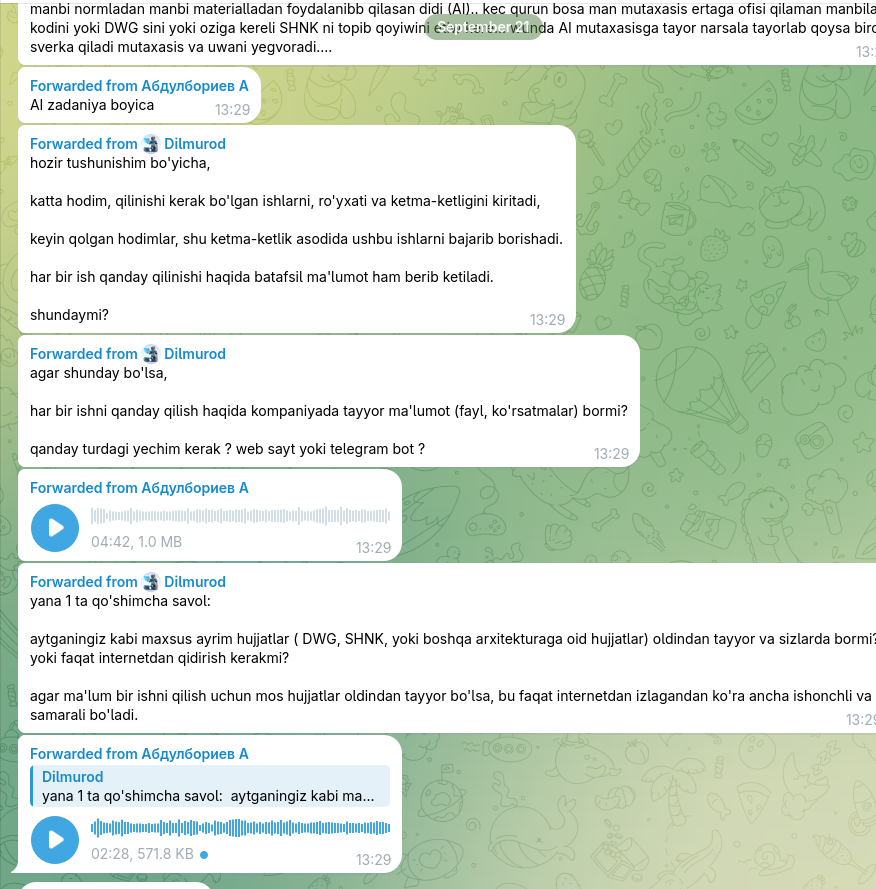

[21/09/2026 13:29] Dilmurod: umumiy iwlani yozib filtirlab qaysi iwi bugun qiliw kereligini ertalab 9da eslatib kec qurun 19.00da ertangi qiladigan iwini vazifalarini eslatiw... yokida kereli materiallar tayorlawini mutaxasis soraw.. yani aytaylik bugun ertalab dom qiliwin kere mana san manbi normladan manbi materialladan foydalanibb qilasan didi (AI).. kec qurun bosa man mutaxasis ertaga ofisi qilaman manbilani kodini yoki DWG sini yoki oziga kereli SHNK ni topib qoyiwini etiw kere... wunda AI mutaxasisga tayor narsala tayorlab qoysa biro sverka qiladi mutaxasis va uwani yegvoradi....
[21/09/2026 13:29] Dilmurod: AI zadaniya boyica
[21/09/2026 13:29] Dilmurod: hozir tushunishim bo'yicha,

katta hodim, qilinishi kerak bo'lgan ishlarni, ro'yxati va ketma-ketligini kiritadi, 

keyin qolgan hodimlar, shu ketma-ketlik asodida ushbu ishlarni bajarib borishadi.

har bir ish qanday qilinishi haqida batafsil ma'lumot ham berib ketiladi.

shundaymi?
[21/09/2026 13:29] Dilmurod: agar shunday bo'lsa,

har bir ishni qanday qilish haqida kompaniyada tayyor ma'lumot (fayl, ko'rsatmalar) bormi?

qanday turdagi yechim kerak ? web sayt yoki telegram bot ?
[21/09/2026 13:29] Dilmurod: [ Voice message ]
[21/09/2026 13:29] Dilmurod: yana 1 ta qo'shimcha savol:

aytganingiz kabi maxsus ayrim hujjatlar ( DWG, SHNK, yoki boshqa arxitekturaga oid hujjatlar) oldindan tayyor va sizlarda bormi? 
yoki faqat internetdan qidirish kerakmi?
 
agar ma'lum bir ishni qilish uchun mos hujjatlar oldindan tayyor bo'lsa, bu faqat internetdan izlagandan ko'ra ancha ishonchli va samarali bo'ladi.
[21/09/2026 13:29] Dilmurod in reply to Dilmurod:
> ‎⁨yana 1 ta qo'shimcha savol:  aytganingiz kabi maxsus ayrim...
[ Voice message ]




here are the instructions from the buyer in uzbek. communicate with me in english. 

<video controls src="audio_2026-09-22_15-45-17.ogg" title="voice message 1"></video>
<video controls src="audio_2026-09-22_15-45-26.ogg" title="voice message 2"></video>


summarize all that and create concise task description

---

# Task Description: AI Architectural Copilot Telegram Bot

## 1. Executive Summary
An AI-powered Telegram Bot designed for an architectural and engineering design firm in Uzbekistan. The bot acts as an intelligent daily assistant for specialists (architects, structural engineers, interior designers, cost estimators). It gathers tomorrow's project assignments each evening at **19:00**, processes technical research overnight, and delivers a comprehensive **"Cheat Sheet" (Dossier)** each morning at **09:00** with regulatory norms, recommended materials, local sourcing, green technology solutions, and starting CAD/DWG assets.

---

## 2. Target Specialists
- **Architects**: Floor plans, room distribution, spatial organization, finishings (walls, floors, ceilings).
- **Structural Engineers (*Konstruktor*)**: Structural framing, load-bearing elements, structural norms.
- **Cost Estimators (*Smetchik*)**: Cost estimation, bill of quantities, local market pricing.
- **Interior & Facade Designers**: Interior styling, facade treatments, compliance with urban design codes.

---

## 3. Daily Operational Workflow

```
┌─────────────────────────────────────────────────────────────────────────┐
│ 19:00 PM — Evening Prompt (Telegram)                                    │
│ - Bot asks specialist: "What project/task will you work on tomorrow?"   │
│ - Specialist replies with project type (e.g. 3-story office, residence) │
│   and specific parameters/keywords (e.g. eco-friendly, modern facade).  │
└────────────────────────────────────┬────────────────────────────────────┘
                                     │
                                     ▼
┌─────────────────────────────────────────────────────────────────────────┐
│ Overnight — AI Processing & Knowledge Retrieval                         │
│ - Analyzes project typology against local climate and urban context.    │
│ - Retrieves relevant Uzbek building codes (SHNK/QMQ) & design codes.    │
│ - Selects optimal materials & checks availability in Uzbekistan.        │
│ - Compiles global/European best practices & green building features.   │
│ - Identifies or prepares base AutoCAD (DWG) reference templates.        │
└────────────────────────────────────┬────────────────────────────────────┘
                                     │
                                     ▼
┌─────────────────────────────────────────────────────────────────────────┐
│ 09:00 AM — Morning Briefing Delivery (Telegram)                         │
│ - Bot delivers the complete "Cheat Sheet" / dossier to the specialist.  │
│ - Specialist reviews pre-compiled norms, materials, and CAD files.      │
│ - Specialist starts project execution with 40-60% of prep work done.    │
└─────────────────────────────────────────────────────────────────────────┘
```

---

## 4. Key Functional Requirements

### 4.1. Automated Telegram Notification System
- **19:00 Evening Trigger**: Automated reminder asking the specialist to submit the next day's task and target building details.
- **Flexible Specialist Inputs**: Specialist can specify building type (office, residential, retail showroom, etc.), stories/size, and specific prompt keywords.
- **09:00 Morning Delivery**: Scheduled automated delivery of the customized research dossier prior to the start of the workday.

### 4.2. Automated Technical Dossier ("Cheat Sheet") Generation
When preparing the brief for a specific project, the AI generates:
1. **Regulatory & Normative Standards**:
   - Relevant Uzbekistan national building regulations: **SHNK / QMQ** (*Qurilish Me'yorlari va Qoidalari*).
   - Municipal regulations (e.g., approved **Tashkent City Design Codes**).
2. **Material Optimization & Local Sourcing**:
   - Recommendations for materials optimized for speed of construction, cost efficiency, and Uzbekistan's climate.
   - Sourcing guidance: where to procure recommended materials locally within Uzbekistan.
3. **Sustainable & Innovative Technologies**:
   - Renewable energy integration (e.g., solar panels).
   - Water conservation and greywater recycling systems (filtering sink/HVAC runoff for sanitary/toilet reuse, modeled on modern business centers like Trilliant).
4. **Two-Tier Solutions (Uzbekistan Standard vs. Global Benchmarks)**:
   - **Local Tier (Default)**: Cost-effective, practical solutions tailored for local budget realities.
   - **Global Tier (Optional/Keyword-triggered)**: Advanced European and international architectural trends and energy efficiency standards for high-end projects.
5. **CAD / Technical Starter Assets (DWG References)**:
   - Provision of base DWG/CAD templates and typical detail drawings (providing a 40–60% completed foundation so specialists do not start from a blank canvas).

### 4.3. Administrator & User Hierarchy
- **First-User-is-Admin**: The very first user who connects with the bot is automatically granted `is_admin = True`.
- **Admin Delegation (`/set_admin`)**:
  - An admin can run `/set_admin` to view an interactive list of all non-admin specialists.
  - Selecting a user from the inline keyboard promotes them to Administrator immediately.
  - Both the acting admin and the promoted user receive real-time confirmation notifications.
- **Admin Dashboard (`/admin`)**: Overview of active team members, admin counts, and system metrics.

---

## 5. Recommended Tech Stack
- **Interface**: Telegram Bot API (using `python-telegram-bot` or `aiogram`).
- **AI / LLM Engine**: Multi-modal LLM (e.g., Gemini 1.5 Pro / GPT-4o) with web browsing/search tools for live data.
- **Scheduler & Queue**: Celery / Redis / APScheduler for reliable 19:00 and 09:00 cron triggers.
- **Database / Vector Store**: PostgreSQL with `pgvector` or ChromaDB for indexing local SHNK building codes, material catalogs, and firm DWG archives.